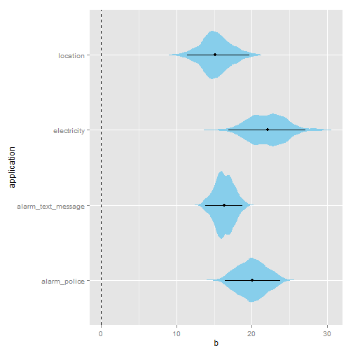
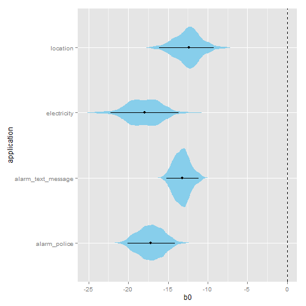
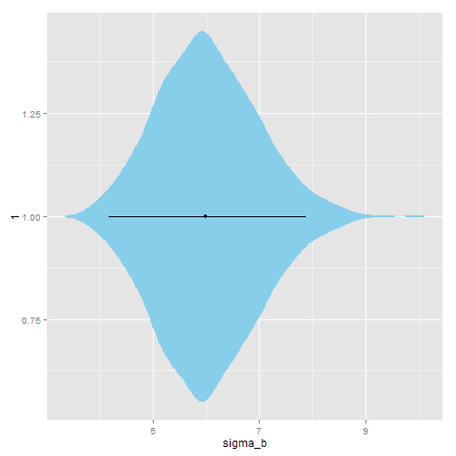
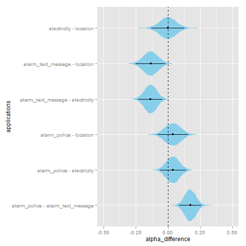

# Code for _How good is 85%? A survey tool to connect classifier evaluation to acceptability of accuracy_

<a rel="license" href="http://creativecommons.org/licenses/by/4.0/"></a> _Matthew Kay ([mjskay@uw.edu]
(mailto:mjskay@uw.edu)), Shwetak N. Patel ([shwetak@uw.edu]
(mailto:shwetak@uw.edu)), and Julie A. Kientz ([jkientz@uw.edu]
(mailto:jkientz@uw.edu))_

This repository contains analysis code from: 

Kay, Matthew, Patel, Shwetak N., and Kientz, Julie A. How Good is 85%? A Survey 
Tool to Connect Classifier Evaluation to Acceptability of Accuracy. _CHI 2015_
(upcoming). http://dx.doi.org/10.1145/2702123.2702603

It is intended to allow others to adopt our tool for generating surveys and
modelling acceptability of accuracy. It is currently a work-in-progress. If you
have any questions, please email Matthew Kay (above). Also, if you've done 
something cool with this work, we'd love to hear from you!

## Libraries needed for these analyses


```r
library(runjags)
library(tidybayes)
library(metajags)
library(coda)
library(lme4)
library(plyr)
library(dplyr)
library(ggplot2)
library(pander)
```

Plus some helper functions in [util.R](util.R):


```r
source("util.R")
```

## Example model

### Fitting the model
Example code for fitting a model can be found in [src/application_ui-regression.R](src/application_ui-regression.R). Since fitting 
the model takes some time, for the purposes of this example we will just load the fitted model, 
which has been saved in `src/output/acceptability_ui-model-small-final.RData`:


```r
load(file="output/acceptability_ui-model-small-final.RData")
```

### Parameter estimates

Let's plot some posterior parameter estimates. First, we extract the 
sample estimates for `b0`, `b`, and `alpha`:


```r
params = extract_samples(best_model_chain, b0[application]) %>%
    left_join(extract_samples(best_model_chain, b[application])) %>%
    left_join(extract_samples(best_model_chain, alpha[application])) 
```

```
## Joining by: c(".sample", "application")
## Joining by: c(".sample", "application")
```

This gives us a pretty simple table of estimates. We can look at the
first couple of entries to get an idea of its structure:


```r
head(params)
```


|  .sample  |  application  |   b0   |   b   |  alpha  |
|:---------:|:-------------:|:------:|:-----:|:-------:|
|     1     | alarm_police  | -15.65 | 18.49 | 0.5639  |
|     2     | alarm_police  | -16.58 | 20.07 | 0.5377  |
|     3     | alarm_police  | -17.05 | 19.83 | 0.4827  |
|     4     | alarm_police  | -16.86 | 19.22 | 0.5002  |
|     5     | alarm_police  | -16.2  | 18.64 | 0.4509  |
|     6     | alarm_police  | -16.18 | 17.97 | 0.5414  |

Now we'll plot each parameter in turn, with some useful reference lines:


```r
ggposterior(params, aes(x=application, y=b)) +
    geom_hline(yintercept=0, lty="dashed")
```

 

```r
ggposterior(params, aes(x=application, y=b0)) +
    geom_hline(yintercept=0, lty="dashed")
```

 

```r
ggposterior(params, aes(x=application, y=alpha)) +
    geom_hline(yintercept=0.5, lty="dashed") +
    ylim(0, 1)
```

 

### Differences in alpha

We can also examine the posterior difference in alpha between each condition. First
we extract the samples for alpha, this time in a wide format to facilitate comparison:


```r
alpha = extract_samples(best_model_chain, alpha[application] | application)
```

Again, let's see the first couple of entries to get an idea of its structure:


```r
head(alpha)
```


|  .sample  |  alarm_police  |  alarm_text_message  |  electricity  |  location  |
|:---------:|:--------------:|:--------------------:|:-------------:|:----------:|
|     1     |     0.5639     |        0.2988        |    0.5119     |   0.3859   |
|     2     |     0.5377     |        0.3567        |    0.4585     |   0.577    |
|     3     |     0.4827     |        0.3135        |    0.4513     |   0.4802   |
|     4     |     0.5002     |        0.3772        |    0.4969     |   0.5148   |
|     5     |     0.4509     |        0.2896        |    0.4851     |   0.5001   |
|     6     |     0.5414     |        0.3805        |    0.5025     |   0.5161   |

Now, for every pair of applications, let's get the posterior distribution
of their difference in alpha:


```r
alpha_comparisons = ldply(combn(levels(df$application), 2, simplify=FALSE), 
    function(applications) {
        data.frame(
            applications = paste(applications, collapse=" - "), 
            alpha_difference = alpha[[applications[[1]]]] - alpha[[applications[[2]]]]
        ) 
    })
```

Which looks like this:


```r
head(alpha_comparisons)
```


|           applications            |  alpha_difference  |
|:---------------------------------:|:------------------:|
| alarm_police - alarm_text_message |       0.2651       |
| alarm_police - alarm_text_message |       0.181        |
| alarm_police - alarm_text_message |       0.1692       |
| alarm_police - alarm_text_message |       0.123        |
| alarm_police - alarm_text_message |       0.1614       |
| alarm_police - alarm_text_message |       0.1609       |

Finally, we can plot the estimated differences:


```r
ggposterior(alpha_comparisons, aes(x=applications, y=alpha_difference)) + 
    geom_hline(yintercept=0, lty="dashed") +
    ylim(-0.5, 0.5)
```

 

## Citing this work

Please cite the CHI paper above.

## Problems

Should you encounter any issues with this code, contact Matthew Kay
(<mjskay@uw.edu>). If you have found a bug, please file it [here](https://github.com/mjskay/acceptability-of-accuracy/issues/new) with minimal code to reproduce
the issue.


